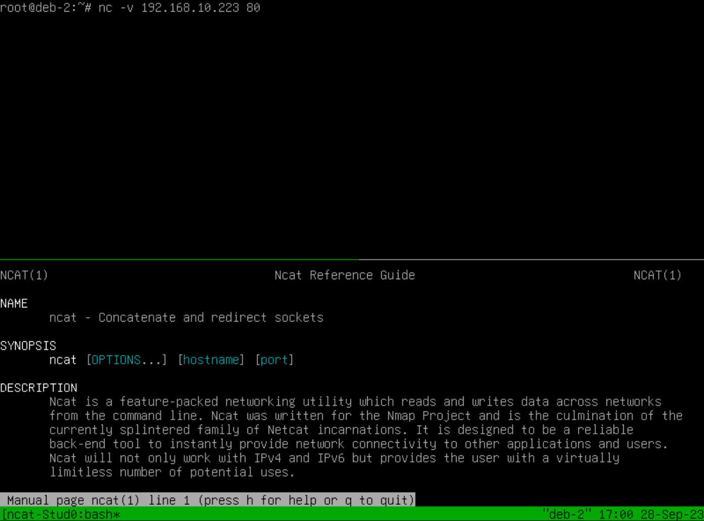

# Using Tmux to Study Linux Tools

The idea here is to facilitate the study of Linux tools using the command line interface (CLI) without the need for written notes or an open browser. Tmux excels at this, so let's get started.

(Please remember to use 'sudo' if you are not the root user.)

## Getting Started

_First, let's ensure our system is up to date and that Tmux is installed:_

**sudo apt update -y**
**sudo apt install tmux -y**

_After the installation is complete, start Tmux by simply typing:_

**tmux**

Now, you're in a Tmux terminal screen with a distinctive green status bar at the bottom.

_Tmux provides a range of commands accessible through a specific key combination: Ctrl-b. For instance:_

    (directional arrow) -> Move to the terminal pane in that direction.
    % -> Split the window horizontally.
    " -> Split the window vertically.
    X -> Close a pane.
    $ -> Rename the session.
    c -> Create a new window.
    n -> Move to the next window.
    p -> Move to the previous window.
    (enter number) -> Move to a specific window by its number.

While Tmux offers many commands, for our purpose, we only need to create extra panes and learn how to close them.

_Creating a Study Session (after opening Tmux - all single letter commands after pressing Ctrl-b):_

**"**
**$**
**ncat-Study**

This sequence creates a Tmux session, adds a second pane at the bottom, and renames the session.

_Now, install ncat and clear the screen:_

**sudo apt install ncat -y**
**clear**

_Navigate to the lower pane with the ncat manual page:_

**(down arrow)**
**man ncat**

You now have two panes—one above, ready for your work, and one below, displaying the ncat manual page.

Practical Use Case: SSH and SCP Learning.

Imagine you're learning about SSH. You can create three panes:

- The upper two panes for connecting to different machines using SSH.
- The lower pane for displaying the SSH manual page (man ssh).

With this setup, you can practice SSH commands in the upper panes while referring to the manual page in the lower pane. You can also introduce SCP to transfer files between machines, change file permissions, and explore other SSH-related tasks—all within the same Tmux session.

_Detaching and Reattaching:_

One of Tmux's most powerful features is the ability to detach and reattach sessions:

_Starting (and naming) a new session:_

**tmux new-session -s <name_of_session>**

_Detaching the session (again, Ctrl-b is used first):_

**d**

_Reattaching the session:_

**tmux attach-session -t <name_of_session>**

_So, you can "Ctrl-b" and "d" at any time, go for a stroll, and when you want to continue your study session. In our example:_

**tmux attach-session -t ncat-Study**

And there you have it! You're back in your ncat study session.

The possibilities with Tmux are endless.
